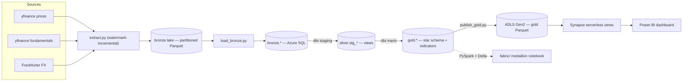

# MarketLake — Cloud-Native Market Data Platform on Azure

[](https://github.com/Jemz-14/marketlake/actions/workflows/ci.yml)
[](LICENSE)

A production-style **medallion-architecture** data platform on **Microsoft Azure**:
it ingests multi-source market data, lands it in a lake, models it into a
**tested star schema** with **dbt**, serves it through **Synapse serverless** and
**Power BI**, is provisioned with **Terraform** and gated by **GitHub Actions
CI** — with a **PySpark + Delta Lake** reimplementation alongside. Built
incrementally as a portfolio project that exercises the patterns hiring managers
screen for.

**Stack:** Python (pandas) · SQL / T-SQL · Azure SQL Database (serverless) ·
Azure Synapse Analytics (serverless) · ADLS Gen2 · dbt (`dbt-sqlserver`) ·
PySpark · Delta Lake · Terraform · Docker · GitHub Actions · Power BI

## Highlights
- **Medallion architecture** (bronze → silver → gold) — every transform explicit, tested, re-runnable.
- **Incremental, watermark-based** multi-source ingestion; idempotent re-runs.
- **Dimensional star schema** (facts + conformed dimensions, surrogate keys) with **40 dbt data-quality tests** gating every build.
- **Technical indicators** (SMA, EMA, RSI, MACD) computed in SQL — and again in PySpark.
- **Synapse serverless** external views over gold Parquet via **managed identity**.
- **Infrastructure as code** (Terraform), **containerised** ingestion (Docker), **CI** on every PR.
- **Cost-engineered**: serverless + auto-pause throughout — total spend kept well under **$30 AUD**.

---

## Architecture



**Medallion layers**
- **bronze** — raw, immutable, partitioned Parquet (`bronze/<source>/date=YYYY-MM-DD/`), then landed 1:1 into the `bronze` SQL schema.
- **silver** — typed, deduplicated, conformed views (`stg_prices`, `stg_fx`, `stg_fundamentals`).
- **gold** — a dimensional star schema plus technical indicators.

### Gold star schema

```
   dim_date ──┐                         ┌── dim_security ──► dim_sector
              ├──< fact_daily_price >──┤
              └────────────────────────┘
                fact_price_indicators (returns, SMA, RSI, EMA, MACD)
```

- `fact_daily_price` — grain: one row per security per day; OHLCV + **AUD-normalised close** (as-of FX join).
- `fact_price_indicators` — daily return, SMA 20/50, RSI-14, EMA 12/26, MACD.
- `dim_security`, `dim_sector`, `dim_date` — conformed dimensions with surrogate keys.
- Referential integrity enforced by dbt `relationships` tests (fact→dims, dim_security→dim_sector).

---

## Repository layout

| Path | What |
|---|---|
| [`ingestion/`](ingestion/README.md) | Python extractors → bronze Parquet (watermark incremental), the bronze→SQL loader, and the Docker image. |
| [`infra/`](infra/README.md) | Terraform for the Azure SQL warehouse, ADLS Gen2, and the Synapse serverless workspace. |
| [`dbt/`](dbt/README.md) | dbt project: silver staging + gold marts, tests, docs. |
| `serving/` | Publish gold → ADLS Parquet and build Synapse serverless views over it. |
| [`fabric/`](fabric/README.md) | PySpark + Delta Lake reimplementation of the gold layer (Microsoft Fabric-ready notebook). |
| `scripts/` | `load-env.ps1` — load `.env` creds into a PowerShell session. |
| `docs/` | [Architecture](docs/architecture.md), [data dictionary](docs/data_dictionary.md), [cost report](docs/cost_report.md), [runbook](docs/runbook.md), analytical SQL queries, Power BI guide + `.pbix`. |
| `.github/workflows/` | CI (lint, tests, Terraform validate, dbt parse) on every PR. |

---

## Quickstart

```powershell
# 0. Python env + warehouse credentials
.\.venv\Scripts\Activate.ps1
pip install -r ingestion\requirements.txt -r ingestion\requirements-warehouse.txt -r serving\requirements.txt
Copy-Item .env.example .env          # then fill in (see infra/ for the password)

# 1. Ingest sources -> local bronze lake (incremental, idempotent)
cd ingestion ; python extract.py ; cd ..

# 2. Provision the cloud infra (Azure SQL warehouse, ADLS Gen2, Synapse serverless)
cd infra ; terraform init ; terraform apply ; cd ..

# 3. Load bronze Parquet -> Azure SQL bronze schema
cd ingestion ; python load_bronze.py ; cd ..

# 4. Build + test the silver & gold models
. .\scripts\load-env.ps1
cd dbt ; .\.venv\Scripts\dbt.exe build --profiles-dir . ; cd ..

# 5. Publish gold -> ADLS Parquet, then build the Synapse serverless views
cd serving ; python publish_gold.py ; python setup_synapse.py ; cd ..

# 6. (Optional) Open docs/marketlake_dashboard.pbix in Power BI Desktop
#    (connect to the Synapse serverless endpoint; see docs/powerbi_guide.md)
```

Per-component details live in the linked READMEs above. The full deploy/teardown
sequence (and operational gotchas) is in the [runbook](docs/runbook.md).

### Containerised ingestion (optional)

```powershell
cd ingestion
docker build -t marketlake-ingest .
docker run --rm -v "${PWD}\_lake:/data" marketlake-ingest
```

### PySpark / Delta edition (optional)

The gold layer is also reimplemented in **PySpark + Delta Lake** for Microsoft
Fabric — see [`fabric/README.md`](fabric/README.md). It runs in a Fabric notebook
or locally, and is validated end-to-end against the dbt output.

---

## Data quality

Every dbt build runs the test suite (**40 tests**): `not_null`, `unique`,
`accepted_values`, composite-key uniqueness, `relationships`, and value-range
checks. A failing test fails the build.

```powershell
cd dbt ; .\.venv\Scripts\dbt.exe test --profiles-dir .
```

View the model documentation and lineage graph:

```powershell
cd dbt ; .\.venv\Scripts\dbt.exe docs generate --profiles-dir . ; .\.venv\Scripts\dbt.exe docs serve --profiles-dir .
```

---

## Cost control

Everything is **serverless / pay-per-use**: the Azure SQL Database auto-pauses
after 1h idle (≈ $0 compute when asleep), Synapse uses the **serverless** SQL
pool (pay-per-query), and ADLS holds a few MB. No dedicated SQL pool, no Spark
cluster, nothing billing by the hour. Tear it all down between sessions with
`cd infra ; terraform destroy`. Total spend was kept **well under $30 AUD** — see
the [cost report](docs/cost_report.md).

---

## Status

- ✅ **Phase 1 — Ingestion → Bronze:** Python extractors (prices, fundamentals, FX), watermark-incremental, partitioned Parquet, Dockerised.
- ✅ **Phase 2 — Transform → Silver & Gold:** Terraform warehouse, bronze loader, dbt silver staging + gold star schema + indicators, tested.
- ✅ **Phase 3 — Serving:** gold published to ADLS Gen2 Parquet; Synapse serverless external views (managed identity); analytical SQL queries; Power BI dashboard.
- ✅ **Phase 4 — Production-readiness:** GitHub Actions CI (lint, tests, Terraform validate, dbt parse); data-quality gates via dbt tests; docs (data dictionary, cost report, runbook, architecture).
- ✅ **Phase 5 — PySpark + Delta Lake edition:** the gold layer reimplemented in Spark, validated end-to-end. *(Fabric-ready; not deployed to a live Fabric workspace.)*

---

## License

[MIT](LICENSE) © James Voinescu
