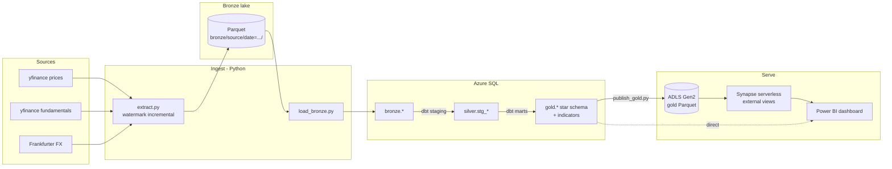

# Architecture

MarketLake is a medallion-architecture data platform on Azure. Sources are
ingested to a partitioned bronze lake, landed in Azure SQL, modelled into a
tested gold star schema with dbt, then served via Synapse serverless and
Power BI. Everything is provisioned with Terraform and gated by GitHub Actions.

## Layers

- **Bronze** — raw, immutable, partitioned Parquet (`bronze/<source>/date=YYYY-MM-DD/`),
  then mirrored 1:1 into the SQL `bronze` schema.
- **Silver** — dbt staging *views*: typed, deduplicated, conformed.
- **Gold** — dbt marts *tables*: a star schema (`fact_daily_price`,
  `fact_price_indicators`, `dim_security`, `dim_sector`, `dim_date`) with
  surrogate keys and `relationships` tests, plus an AUD-normalised close and
  technical indicators.

## Cross-cutting

- **IaC:** Terraform provisions the SQL warehouse, ADLS Gen2, and the Synapse
  workspace — one `apply` / one `destroy`.
- **CI:** GitHub Actions runs ruff + pytest, `terraform fmt`/`validate`, and
  `dbt deps`/`parse` on every PR.
- **Data quality:** dbt tests (`not_null`, `unique`, `accepted_values`,
  `relationships`, range checks) gate every `dbt build`.
- **Cost:** serverless + auto-pause throughout; see [cost_report.md](cost_report.md).

## Key design decisions

- **Multiple sources → a real star schema** (facts + conformed dimensions),
  rather than a single flat price table.
- **Medallion layering** so every transform is explicit, testable, re-runnable.
- **Watermark incremental loading** — only new dates are pulled; runs are idempotent.
- **Synapse serverless over Parquet** demonstrates the Synapse skill at
  pay-per-query cost (no dedicated pool).
